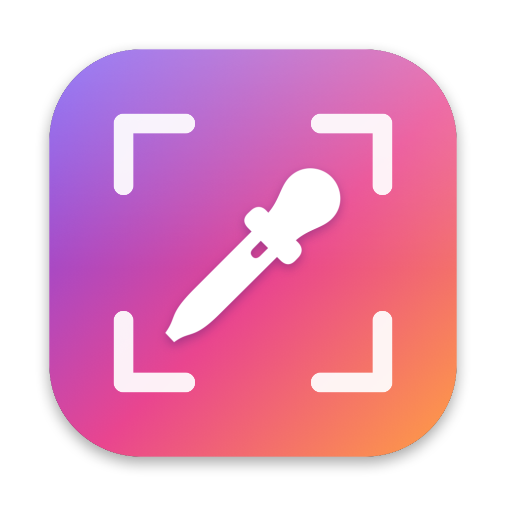

# ColorCapture

macOS 메뉴바 앱 — **색 추출(스포이드)** + **영역 캡처**를 단축키(키보드 또는 마우스 버튼) 하나로.



현재 버전: **1.1**

## 기능

| 기능 | 기본 단축키 | 동작 |
|---|---|---|
| 🎨 색 추출 | `⌃⇧C` (Control+Shift+C) | 돋보기로 화면의 색을 클릭 → HEX 코드(`#FF8800`)를 클립보드에 복사 |
| ✂️ 영역 캡처 | `⌃⇧S` (Control+Shift+S) | 마우스로 드래그해서 영역 캡처 → 클립보드 복사 + `~/Pictures/ColorCapture`에 저장 |

- 캡처 중 `Esc` = 취소, `스페이스` = 창 하나만 캡처
- 복사/캡처가 끝나면 마우스 근처에 작은 알림이 잠깐 표시됨

### 메뉴바 메뉴 (💧 아이콘)

- 색 추출 / 영역 캡처 (현재 단축키 표시)
- **최근 색상** 목록 — 클릭하면 다시 복사, 기록 지우기
- 캡처 폴더 열기
- **단축키 설정…**
- 로그인 시 자동 실행
- ColorCapture 다시 시작 (권한을 바꾼 뒤 적용할 때)
- 종료

### 단축키 설정

메뉴 → `단축키 설정…` → 기능 옆 버튼을 누르고 원하는 키 조합 또는 마우스 버튼을 누르면 등록됩니다.

- **키보드:** ⌘ ⌃ ⌥ 중 하나 이상과 함께 (F1~F20은 단독 가능)
- **마우스:** 휠 클릭, 옆 버튼(뒤로/앞으로) 등 — 단독 또는 `⌥ + 휠 클릭`처럼 조합
- `Esc` = 취소, `기본값으로 되돌리기` = ⌃⇧C / ⌃⇧S
- 두 기능에 같은 조합, 다른 앱이 쓰는 조합은 등록되지 않고 이유가 표시됨
- 한글 입력 중에도 키 이름은 영문으로 표시 (ㅊ → C)

## 설치

1. 저장소의 [`dist/`](dist/) 폴더에서 `ColorCapture-<버전>.pkg`를 받아 더블클릭 (또는 `./make_pkg.sh`로 직접 만들기)
   - 인터넷에서 받은 파일은 "확인되지 않은 개발자" 경고가 뜰 수 있음 → 우클릭 → 열기
2. 설치하면 `/Applications/ColorCapture.app`에 들어가고 자동 실행

터미널로 설치하려면:

```bash
sudo installer -pkg dist/ColorCapture-1.1.pkg -target /
```

## 권한

| 권한 | 필요한 이유 | 없으면 |
|---|---|---|
| **화면 및 시스템 오디오 기록** | 영역 캡처 | 캡처하지 않고 안내 창 + 설정 화면 열기 |
| **손쉬운 사용** | 마우스 단축키를 다른 앱에 전달하지 않기 | 단축키는 동작하지만 다른 앱의 원래 동작도 같이 일어남 |

시스템 설정 → 개인정보 보호 및 보안 → 해당 항목 → ColorCapture 켜기 → 메뉴 → `ColorCapture 다시 시작`

**권한이 켜져 있는데도 안 될 때** (예전 빌드의 권한 기록이 남은 경우):

```bash
tccutil reset ScreenCapture com.local.ColorCapture
tccutil reset Accessibility com.local.ColorCapture
```

실행 후 앱을 다시 시작하고 권한을 새로 허용하세요.
권한 상태는 `~/Library/Logs/ColorCapture.log`에서 확인할 수 있습니다.

## 빌드

요구 사항: macOS 13 이상, Xcode (또는 Swift 툴체인)

```bash
# 설치 파일 만들기 → dist/ColorCapture-<버전>.pkg (이전 버전 파일은 자동 삭제)
./make_pkg.sh

# 테스트용: 앱만 만들고 바로 실행 → ~/Applications/ColorCapture.app
./build.sh
```

- 버전은 `Info.plist`의 `CFBundleShortVersionString`에서 바꿈
- 개인용 서명이라 **다시 빌드하면 macOS가 새 앱으로 보고 권한을 다시 요청**할 수 있음
- `build.sh`(테스트용)와 설치 파일 버전을 같이 쓰면 앱이 두 개가 되어 단축키가 겹치니 하나만 사용

앱 아이콘을 다시 그리려면:

```bash
swift scripts/make_icon.swift Resources/icon_1024.png
```

## 구조

```
Sources/ColorCapture/
  App.swift               앱 시작점 (메뉴바 전용)
  AppDelegate.swift       메뉴, 색 추출, 영역 캡처, 자동 실행, 다시 시작
  HotKey.swift            키보드 전역 단축키 (Carbon)
  MouseHotKey.swift       마우스 버튼 단축키 (이벤트 탭 / 전역 모니터)
  Shortcut.swift          단축키 정의·저장, 키 이름 표시
  ShortcutSettings.swift  단축키 설정 창
  HUD.swift               복사/캡처 완료 알림 창
  DebugLog.swift          문제 확인용 기록 (~/Library/Logs/ColorCapture.log)
scripts/
  make_icon.swift         아이콘 그리기
  postinstall             설치 후 앱 자동 실행
Resources/
  AppIcon.icns, icon_1024.png
build.sh                  테스트용 빌드
make_pkg.sh               설치 파일 만들기
```

## 변경 기록

### 2026-09-30
- **1.0** 첫 버전: 색 추출(⌃⇧C), 영역 캡처(⌃⇧S), 메뉴바 메뉴, 최근 색상, 로그인 시 자동 실행
- 앱 아이콘 추가
- 설치 파일(.pkg) 만들기 추가 (`make_pkg.sh`)
- 단축키 설정 메뉴 추가 — 원하는 키 조합으로 변경
- 마우스 버튼 단축키 추가 — 휠 클릭, 옆 버튼
- **1.1**로 버전 올림
- 수정: 화면 기록 권한이 없을 때 캡처를 시도하지 않고 안내 + 설정 화면 열기
- 메뉴에 "ColorCapture 다시 시작" 추가
- 수정: 설치 후 앱이 실행되지 않던 문제 (외장하드 파일 권한이 설치 파일에 그대로 들어감)
- 문제 확인용 기록 파일 추가
- 설치 파일을 만들 때 이전 버전 설치 파일 자동 삭제
- README 업데이트: 설치 방법, 권한 문제 해결 방법, 변경 기록 추가
- 설치 파일(`dist/ColorCapture-1.1.pkg`)을 저장소에 올림
